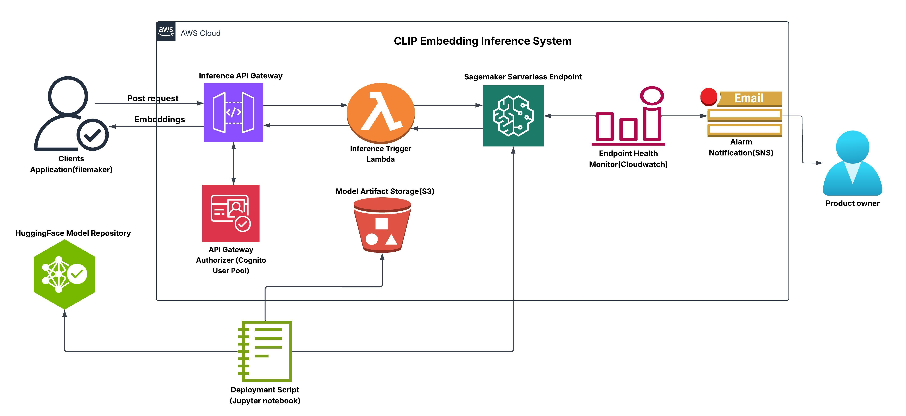

# clip-embedding-api
API service for generating text and image embeddings using CLIP B/32 and L/14 models deployed on AWS SageMaker.

## System Architecture

### 🚀 Features
- **Two API Endpoints**  
  Separate API Gateway endpoints are deployed—one for the CLIP ViT-B/32 model and another for the ViT-L/14 model—allowing flexible embedding generation.

- **Image & Text Embedding**  
  Supports both image and text inputs to produce corresponding embeddings.

- **AWS SageMaker Deployment**  
  Models are deployed on AWS SageMaker serverless endpoints for scalable inference.

- **Lambda Integration**  
  AWS Lambda functions handle API requests and interface with the appropriate SageMaker endpoints.

- **Monitoring**  
  CloudWatch Alarms and SNS topics are set up for monitoring model health and performance.

### 📁 Repository Structure

- **CLIP-ViT-B-32/**  
  Contains deployment scripts and configurations for the ViT-B/32 model.

- **CLIP-ViT-L-14/**  
  Contains deployment scripts and configurations for the ViT-L/14 model.

- **lambda_code_b32model.py**  
  AWS Lambda function code for handling requests to the B/32 model sagemaker endpoint.

- **lambda_code_l14model.py**  
  AWS Lambda function code for handling requests to the L/14 model sagemaker endpoint.

- **clip-ViT-B-32_deploy_job.ipynb**  
  Jupyter notebook for deploying the ViT-B/32 model to SageMaker.

- **clip-ViT-L-14_deploy_job.ipynb**  
  Jupyter notebook for deploying the ViT-L/14 model to SageMaker.

